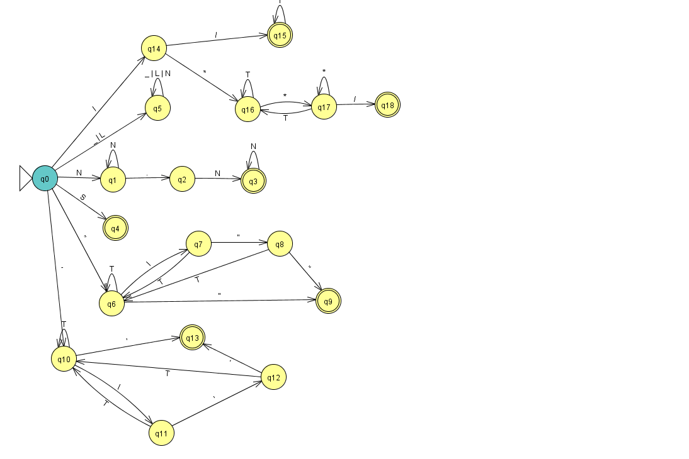

# MANUAL DE TÉCNICO - OLC1 PROYECTO 2

## Traducción JS

Para realizar la traducción de Java a JavaScript se realizo a través de la herramienta de Jison.

## Traducción a Python

Para realizar la traducción de Java a Python se realizo creando un analizador léxico mediante estados y un analizador sintáctico con el método de parea.

## Construcción de API

Para la construcción de la Api se utilizo NodeJS utilizando el puerto 3000 el cual puede ser modificado si se desea.

También se utilizaron los siguientes módulos para la API

* Express
* Cors
* Morgan

## Página Web

Para levantar el servicio web se utilizo Golang el cual funciona en el puerto 8080, dicho servicio web nos permite visualizar y manejar las peticiones API, trabajando de la siguiente forma:

* Ajax <---> Go <---> NodeJS