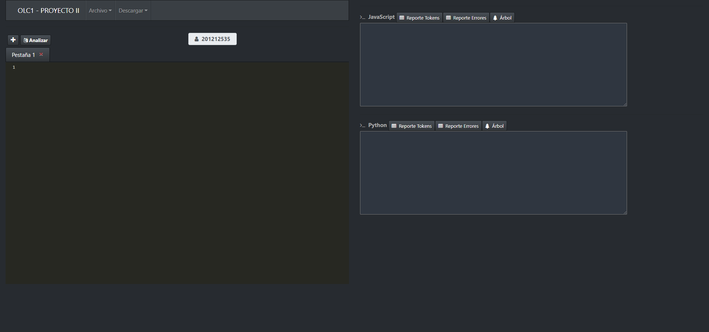
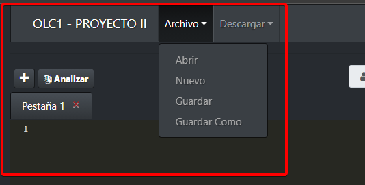
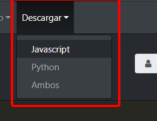
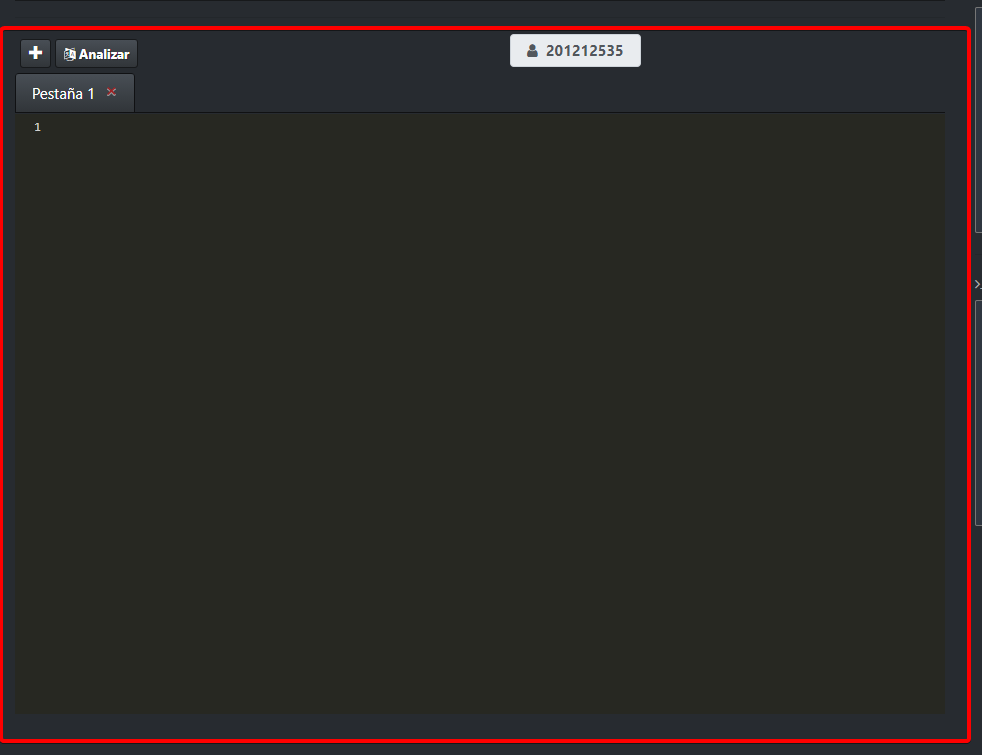
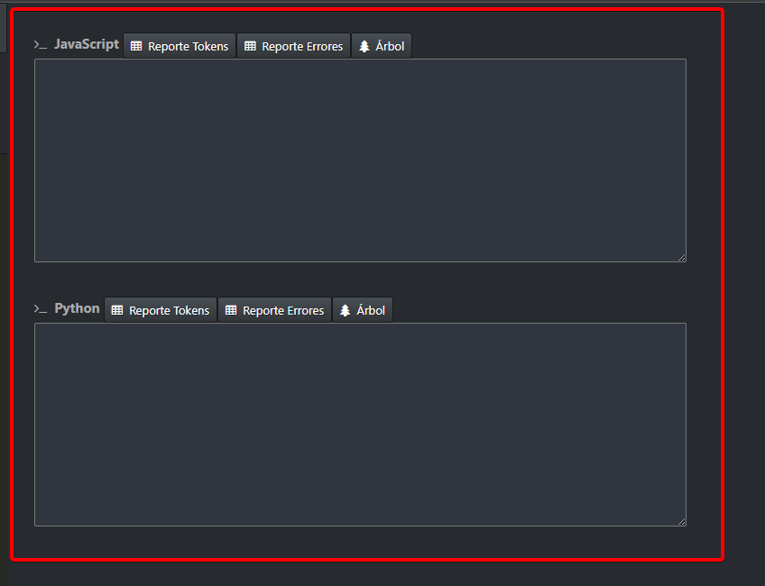

# MANUAL DE USUARIO - OLC1 PROYECTO 2

Aplicación para traducir un archivo Java a Javascript y Python.

Lea cuidadosamente el siguiente manual, para un uso de la aplicación correcta.

## Vista General de la Aplicación

## Archivo

* Abrir: Permite abrir un archivo Java.
* Nuevo: Permite crear un nuevo archivo en blanco.
* Guardar: Permite guardar el archivo.
* Guardar Como: Permite guardar el archivo con una extensión deseada.

## Descargar

* Javascript: Permite descargar la traducción en javascritpt.
* Python: Permite descargar la traducción en python.
* Ambos: Permite descargar la traducción de ambos formatos (javascript y python).

## Edición

Dicho apartado le permite escribir código en java para su posterior analisis.

También podra crear varias pestañas para tener varias ediciones de archivos distintos.

## Reportes

Dicho apartado encontrará una consola la cual mostrará los errores léxicos y sintacticos que fueron encontrados en el archivo de entrada.

Tambíen podra consultar el reporte de tokens, errores, así como el gráfico del árbol sintáctico.

